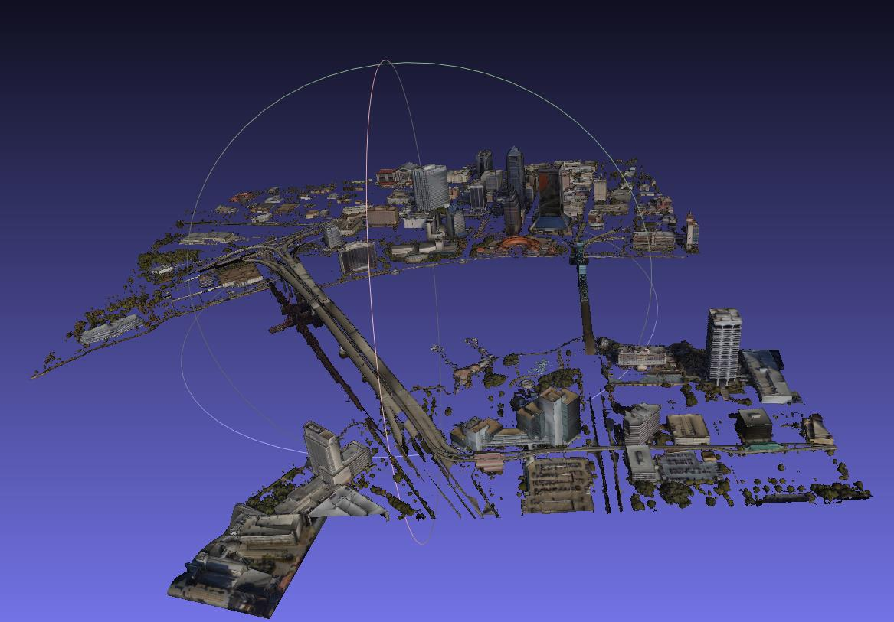
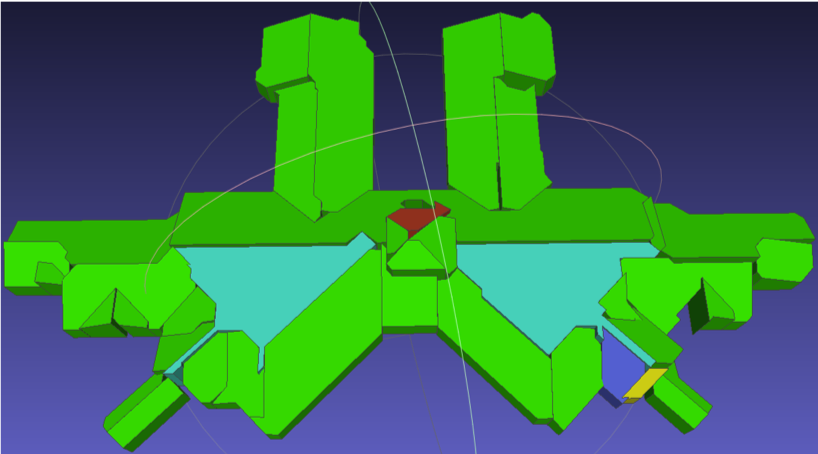
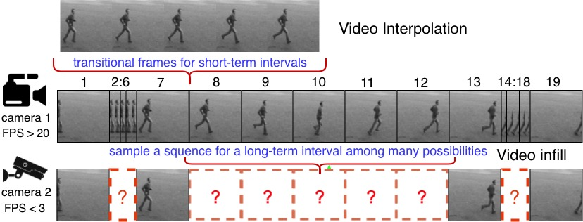
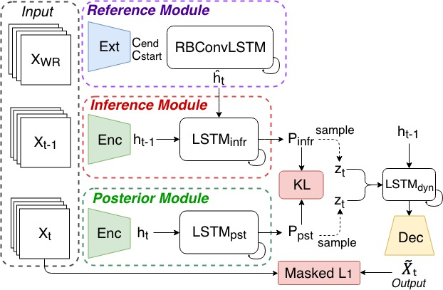
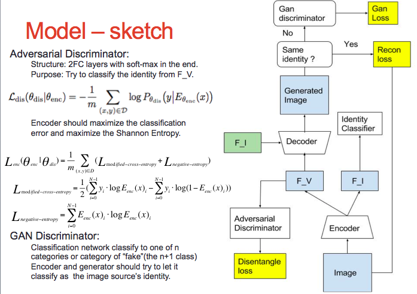
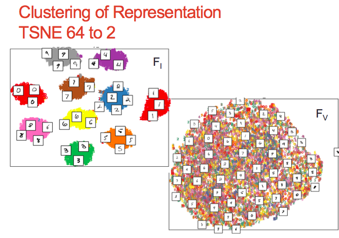
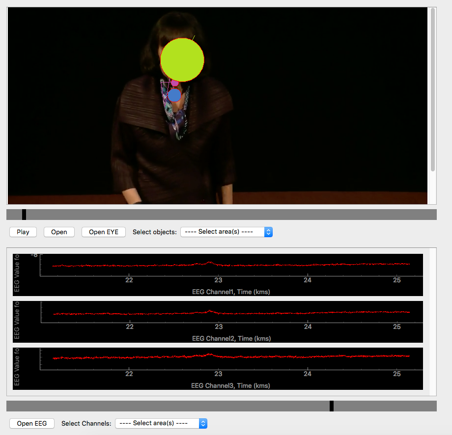
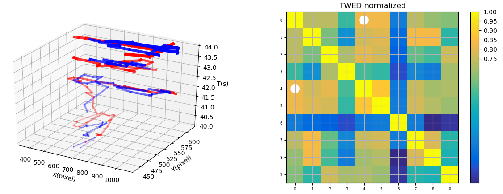



## Research Interests

I am interested in many different aspects of Computer Vision:

- Large-scale representation learning of 3D Point Cloud
- Instance Segmentation and Object Detection of 3D Point Cloud
- Generative model in video (Frame Prediction and Interpolation).
- Representation learning and feature disentanglement
- Statistical Learning

## Current Projects

### 3D Project 
Currently I start to involve in a new project funded by Adobe Research, designing model to transform a 3D mesh to a target 3D model/2D image while still holding its topological structure.

## Previous Projects

### Core 3D (Funded by IARPA)
The goal of this project is to construct 3D building models from large-scale satellite DEM and point cloud. The point cloud covers several regions of different geographical locations.
I have: 
•	Used concepts of principal direction to rectify the building 2D contour after planar RANSAC.
•	Simplified, merged and aligned the edges according to the proximity in Hough space.
•	Clustered the plane’s norm direction using DBSCAN and adjusted them to conventional angles. 

Motivaton  |   single building result           
:-------------------------:|:-------------------------:
{::width="60%"}   |  {::width="100%"} 

 

### Stochastic Dynamics for Video Infilling \[[paper](https://arxiv.org/abs/1809.00263){:target="blank"}\] \[[project site](../projects/project_sites/SDVI/video_results.html){:target="blank"}\] 

&nbsp;&nbsp;&nbsp;&nbsp;&nbsp; We introduce a stochastic generation framework (SDVI) to infill long intervals in video sequences. SDVI consists of two parts: (1) a bi-directional constraint propagation
to guarantee the spatial-temporal coherency among frames, (2) a stochastic sampling process to generate dynamics from the inferred distributions. Experimental results show that SDVI can generate clear and varied sequences.

Motivation |   Model           
:-------------------------:|:-------------------------:
  |  

 

### Variation Disentanglement Siamese Net \[[project site](https://github.com/Xharlie/Project-Site-Variation-Disentanglement-Siamese-Net){:target="blank"}\]  \[[code](https://github.com/Xharlie/Variation-Disentanglement-Siamese-Net){:target="blank"}\]

&nbsp;&nbsp;&nbsp;&nbsp;&nbsp; A project to study unsupervised disintanglement of image representation: Supervised by Prof. Shih-Fu Chang:
-	Designed a semi-supervised network that disentangles the label-related and variance representation of a manifold.
-   Introduced a Shannon-Entropy based adversarial training counterpart to help the disentanglement, expelling any label-related information from the variance representation.
-   Setting recognition and reconstruction task to keep the richness in the feature embedding.
-	Implemented the proposed network and conducted the experiment on both MNIST and CASIA Face dataset. Conducted disentanglement, reconstruction, cross-stich evaluation and TSNE Clustering on learnt representation.

Model            |  Feature space interpolation  | Feature space clustering
:-------------------------:|:-------------------------:|:-------------------------:
  |  {:class="third" id="columns"} | 

 

### Neural Gesture (Funded by NSF) \[[paper](https://arxiv.org/abs/1712.09709){:target="blank"}\] \[[code](https://github.com/Xharlie/Eye-movement-similarity-clustering){:target="blank"}\] 

&nbsp;&nbsp;&nbsp;&nbsp;&nbsp; A NSF project leaded by Prof. John Kender, studying relationship between gestures of speakers and audiences’ attention. I have: 
-	Design and implemented distance matching algorithm based on “Time Warp Edit Distance” between every pair of eye tracking trajectories to get a eye-tracking distance matrix.
-	Fine-tuned the hyper-parameter of TWED based algorithm by comparing eye movement trails.
-	Clustered subjects based on “fast multi-scale detection of relevant communities” by using the distance matrix.

Attention fixation            |  Eye trajectory and co-relation  
:-------------------------:|:-------------------------:|:-------------------------:
{:width="80%"}  |  {::width="100%"} 